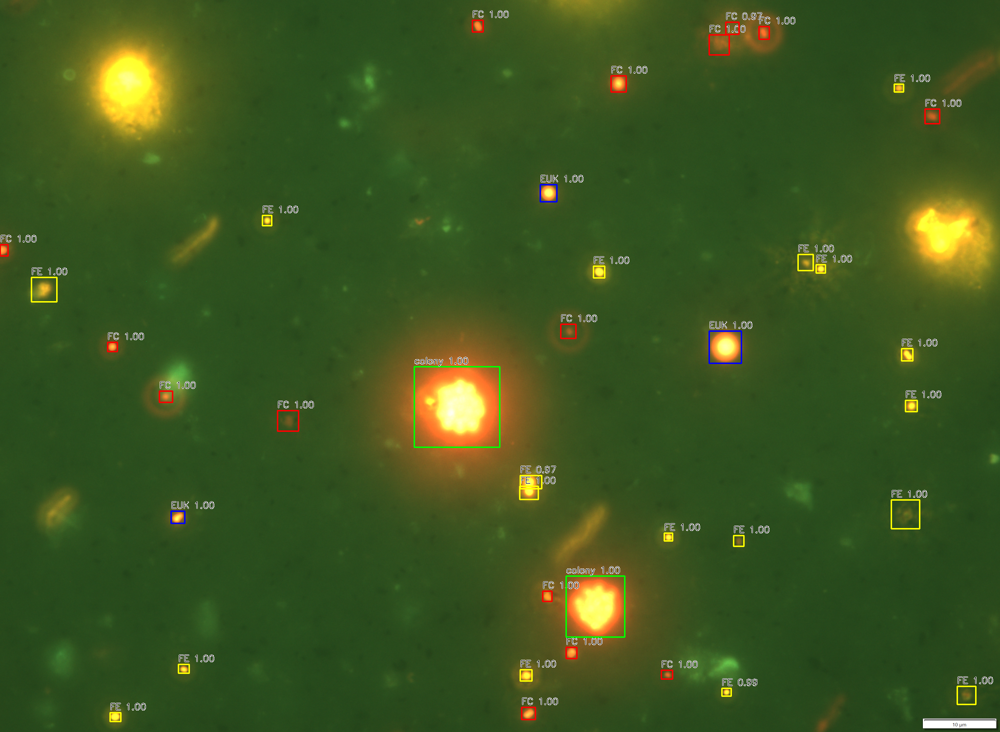
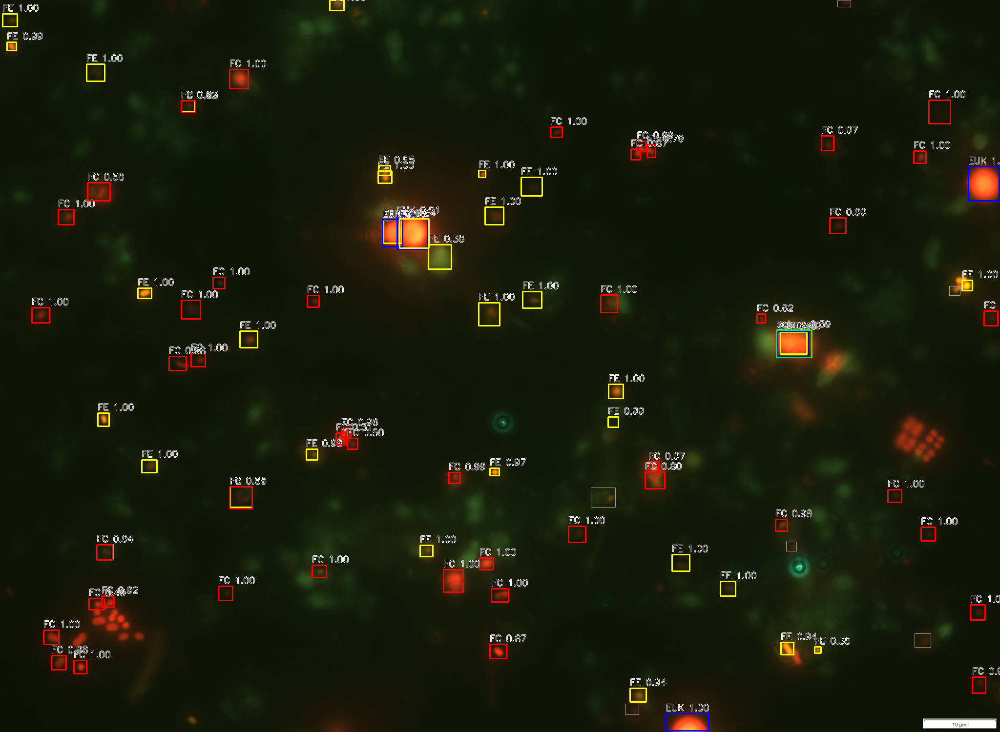
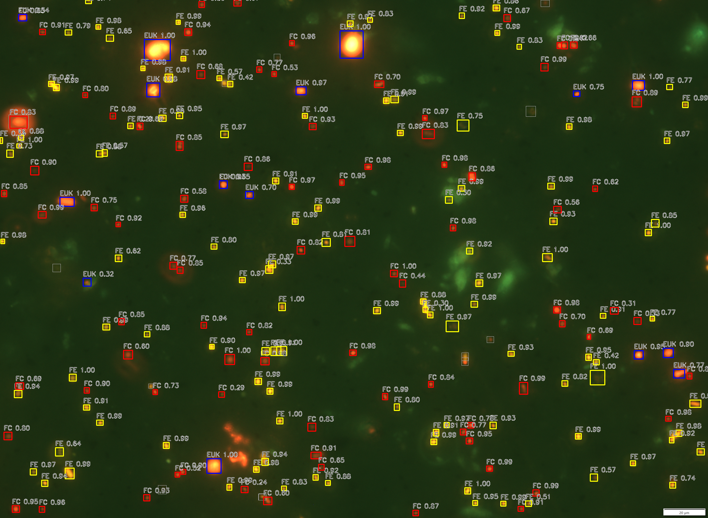

# Pico-Algae Detection using Deep Learning

## Overview

This project detects and counts pico-algae cells in microscopy images using a Faster R-CNN detector.
It is useful for fast, repeatable analysis of samples where manual counting is slow and error-prone.
The pipeline works on paired microscope images (`*_og.png` and `*_red.png`) and predicts cell-level bounding boxes with class labels.
The repository includes training, tuning, and inference utilities for reproducible experiments.

## Example Results

Input image:


Detections with bounding boxes:





## Pipeline Overview

`Image -> preprocessing -> object detection -> counting`

1. Load microscopy image pair (`og` + `red`).
2. Preprocess and resize to model target resolution.
3. Run Faster R-CNN for small-object detection.
4. Filter predictions by confidence and count detections.

## Model

The detector is a 6-channel Faster R-CNN (`ResNet50-FPN`) that fuses `og` and `red` images.
Training uses annotated pico-algae microscopy data with bounding boxes and four foreground classes (`EUK`, `FE`, `FC`, `colony`).
The setup is tuned for dense small-object detection where many tiny cells appear in one frame.

## Installation

```bash
pip install -r requirements.txt
pip install -e .
```

## Usage

Single-image inference (package entrypoint):

```bash
python -m pico_algae.inference --image examples/input_images/test.jpg
```

Single-image inference (console script after editable install):

```bash
pico-algae-infer --image examples/input_images/test.jpg
```

Batch/folder inference (existing pipeline):

```bash
python scripts/predict_frcnn.py --images_dir data/raw/images_og --ckpt runs/train_run01/checkpoints/best_mae.pt --out_dir runs/predict_run --predict_yaml src/configs/predict_frcnn.yaml
```

Training:

```bash
python scripts/train_frcnn.py --index_csv data/processed/dataset_2048x1500_webp/index.csv --out_dir runs/train_run --train_yaml src/configs/train_frcnn.yaml
```

Root CLI wrapper:

```bash
python main.py infer --image examples/input_images/test.jpg
```

## Results

- Classes detected: `EUK`, `FE`, `FC`, `colony`.
- Best post-processing tuning result (`runs/tuning/post_best_mae/tuning_post_results.csv`):
  `mean_count_mae=2.4239`, `std_count_mae=0.5050` across 5 folds.
- Dense-scene challenge: small, overlapping cells can increase count error in crowded regions, so threshold and NMS tuning materially affect counting quality.

## Project Structure

```text
pico-algae-detection/
├── README.md
├── requirements.txt
├── LICENSE
├── configs/
│   └── model_config.yaml
├── docs/
│   └── pipeline_diagram.png
├── examples/
│   ├── example_input.png
│   ├── example_detection.png
│   ├── input_images/
│   └── detection_results/
├── notebooks/
│   └── exploration.ipynb
├── scripts/
│   ├── prep/
│   ├── train_frcnn.py
│   ├── predict_frcnn.py
│   └── inference.py
├── src/
│   ├── data/
│   ├── models/
│   ├── train/
│   ├── inference/
│   ├── utils/
│   └── configs/
└── models/
```

## Repo Conventions

- `src/`: importable implementation code (model, training logic, inference utilities, helpers).
- `scripts/`: runnable entrypoints and operational scripts.
- `scripts/prep/`: dataset preparation and one-off data processing utilities.

## Technologies

- Python
- PyTorch
- OpenCV
- NumPy

## Folder Guide

- `src/train`: training loop, optimization, scheduler, and evaluation code.
- `src/inference`: prediction and visualization utilities.
- `src/models`: Faster R-CNN model builders and checkpoint utilities.
- `src/configs`: YAML configs for train, predict, and tuning.
- `src/utils`: shared helper functions for I/O, seeding, logging, and box ops.
- `scripts/prep`: dataset preprocessing and annotation conversion scripts.
